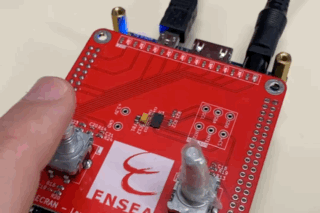
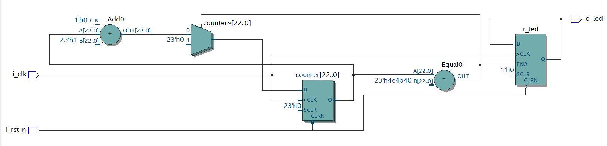
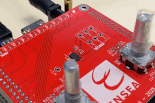
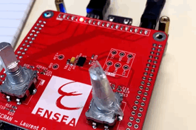

# 2526_ESE_FPGA_ThomasTerlinden_FlorianBonnet--Galand

This repository contains the project files for the [FPGA LAB](https://github.com/lfiack/ENSEA_2A_FPGA_Public/blob/main/mineure/3-tp/fpga_tp_english.md) at ENSEA, completed by Thomas Terlinden and Florian Bonnet-Galand.

## LED blinker with a button control

Implementation of the code:
```vhdl
library ieee;
use ieee.std_logic_1164.all;

entity tuto_fpga is
    port (
        pushl : in std_logic;
        led0 : out std_logic
    );
end entity tuto_fpga;

architecture rtl of tuto_fpga is
begin
    led0 <= not pushl; -- LED is ON when button is pressed
end architecture rtl;
```

### Results:
;

## LED blinker with the clock

Implementation of the code:
```vhdl

library ieee;
use ieee.std_logic_1164.all;

entity led_blink is
    port (
        i_clk : in std_logic;
        i_rst_n : in std_logic;
        o_led : out std_logic
    );
end entity led_blink;

architecture rtl of led_blink is
    signal r_led : std_logic := '0';
begin
    process(i_clk, i_rst_n)
              variable counter : natural range 0 to 5000000 := 0;
    begin
        if (i_rst_n = '0') then
            r_led <= '0';
                        counter := 0;
        elsif (rising_edge(i_clk)) then
                        if (counter = 5000000) then
                               counter := 0;
                               r_led <= not r_led;
                        else
                               counter := counter + 1;
                        end if;
        end if;
    end process;
    o_led <= r_led;
end architecture rtl;
```
Our expected design:

Synthesis Report:
;

### Results:
;
  
Le _n dans i_rst_n fait allusion au fait que le reset est effectif à l'état bas. En effet, on a un reset quand on a un '0', donc on nomme avec un _n pour négatif.

## Chenillard

We use the previous led_blink design as a base to create a chenillard. The counter is modified to change the led that is on every second.
Implementation of the code:
```vhdl
library ieee;
use ieee.std_logic_1164.all;

entity led_chenillard is
    port (
        i_clk   : in std_logic;
        i_rst_n : in std_logic;
        -- On passe d'un std_logic unique à un vecteur de 10 bits (9 à 0)
        o_led   : out std_logic_vector(9 downto 0)
    );
end entity led_chenillard;

architecture rtl of led_chenillard is
    -- Initialisation importante : on met le bit 0 à '1' pour avoir une LED allumée au départ
    -- "0000000001"
    signal r_led : std_logic_vector(9 downto 0) := (0 => '1', others => '0');
   
begin
    process(i_clk, i_rst_n)
        -- Compteur pour gérer la vitesse (identique à votre code)
        variable counter : natural range 0 to 50000000 := 0;
    begin
        if (i_rst_n = '0') then
            counter := 0;
            -- Reset : on revient à la première LED allumée
            r_led <= (0 => '1', others => '0');
           
        elsif (rising_edge(i_clk)) then
            if (counter = 5000000) then -- Vitesse du mouvement
                counter := 0;
               
                -- LOGIQUE DE ROTATION (Chenillard) :
                -- On prend les bits 8 à 0 et on les décale à gauche (vers 9 à 1)
                -- On prend le bit 9 (le plus à gauche) et on le remet tout à droite (bit 0)
                r_led <= r_led(8 downto 0) & r_led(9);
               
            else
                counter := counter + 1;
            end if;
        end if;
    end process;

    -- On connecte le signal interne aux ports de sortie
    o_led <= r_led;

end architecture rtl;
```
### Results:
;
## TELECRAN Board Constraints

J2 corresponds to GPIO0
J1 corresponds to GPIO1

### LEDs
| Name  | GPIO  | FPGA |
| :--- |:-----:| ----:|
| LED0 | J1:5  | AG28 |
| LED1 | J1:7  | AE25 |
| LED2 | J1:9  | AG26 |
| LED3 | J1:13 | AG25 |
| LED4 | J1:17 | AG23 |
| LED5 | J1:21 | AH21 |
| LED6 | J1:25 | AF22 |
| LED7 | J1:27 | AG20 |
| LED8 | J1:33 | AG18 |
| LED9 | J1:37 | AG15 |

### Encoders
| Name      | GPIO  | FPGA |
| :------- |:-----:| ----:|
| LEFT_PB  | J1:10 | AH27 |
| LEFT_A   | J1:8  | AF27 |
| LEFT_B   | J1:6  | AF28 |
| RIGHT_PB | J2:40 | AA11 |
| RIGHT_A  | J2:38 | AA26 |
| RIGHT_B  | J2:39 | AA13 |

### ADXL345
| Name  | GPIO  | FPGA |
| :--- |:-----:| ----:|
| INT1 | J2:33 | Y18  |
| INT2 | J2:34 | Y17  |
| nCS  | J2:32 | W14  |
| SCL  | J2:37 | Y11  |
| SDA  | J2:36 | AB26 |
| SDO  | J2:35 | AB25 |
