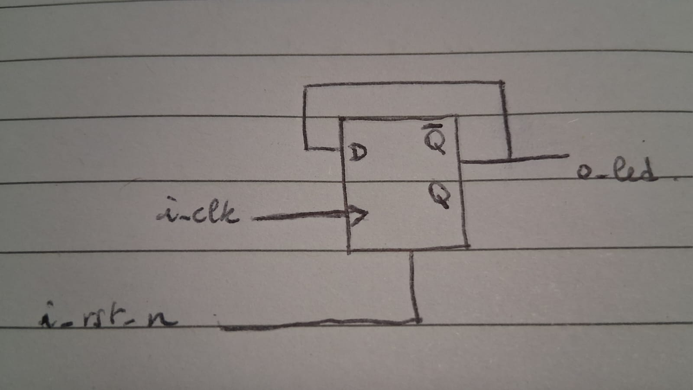
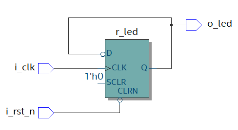

# 2526_ESE_FPGA_ThomasTerlinden_FlorianBonnet--Galand

This repository contains the project files for the [FPGA LAB](https://github.com/lfiack/ENSEA_2A_FPGA_Public/blob/main/mineure/3-tp/fpga_tp_english.md) at ENSEA, completed by Thomas Terlinden and Florian Bonnet-Galand.

## LED blinker with a button control

Implementation of the code:
```vhdl
library ieee;
use ieee.std_logic_1164.all;

entity tuto_fpga is
    port (
        pushl : in std_logic;
        led0 : out std_logic
    );
end entity tuto_fpga;

architecture rtl of tuto_fpga is
begin
    led0 <= not pushl; -- LED is ON when button is pressed
end architecture rtl;
```

Results:
;

## LED blinker with the clock

Implementation of the code:
```vhdl
library ieee;
use ieee.std_logic_1164.all;

entity led_blink is
    port (
        i_clk : in std_logic;
        i_rst_n : in std_logic;
        o_led : out std_logic
    );
end entity led_blink;

architecture rtl of led_blink is
    signal r_led : std_logic := '0';
begin
    process(i_clk, i_rst_n)
    begin
        if (i_rst_n = '0') then
            r_led <= '0';
        elsif (rising_edge(i_clk)) then
            r_led <= not r_led;
        end if;
    end process;
    o_led <= r_led;
end architecture rtl;
```

Here are the diagrams showing the synthesis and implementation results vs what was expected:

Our expected design:

Synthesis Report:
;

The blink is not visible to the naked eye because the frequency is too high (50MHz / 2 = 25MHz). To make it visible, we need to add a frequency divider.
Implementation of the frequency divider code:
```vhdl

library ieee;
use ieee.std_logic_1164.all;

entity led_blink is
    port (
        i_clk : in std_logic;
        i_rst_n : in std_logic;
        o_led : out std_logic
    );
end entity led_blink;

architecture rtl of led_blink is
    signal r_led : std_logic := '0';
       signal r_led_enable : std_logic := '0';
begin
    process(i_clk, i_rst_n)
           variable counter : natural range 0 to 50000000 := 0;
    begin
        if (i_rst_n = '0') then
                        counter := 0;
                        r_led_enable <= '0';
            r_led <= '0';
        elsif (rising_edge(i_clk)) then
                        if (counter = 5000000) then
                               counter := 0;
                               r_led_enable <= '1';
                               r_led <= not r_led;
                        else
                               counter := counter + 1;
                               r_led_enable <= '0';
                        end if;
        end if;
    end process;
    o_led <= r_led;
end architecture rtl;
```
Our expected design:

Synthesis Report:
;

Results:
;

